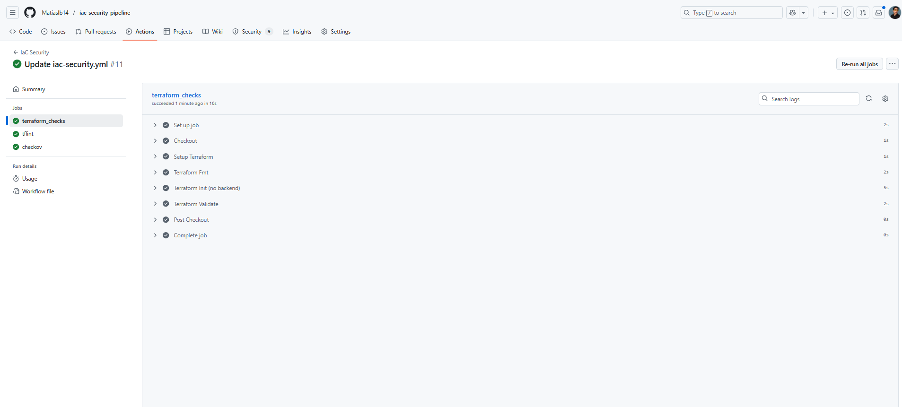
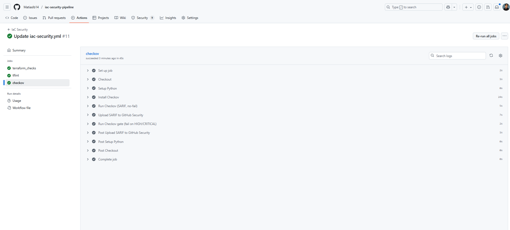

# IaC Security Pipeline 🚀  

This project implements a **CI/CD pipeline for Infrastructure as Code (IaC) security** using **GitHub Actions**.  
The goal is to enforce security and compliance checks automatically whenever Terraform code changes are pushed or reviewed.  

---

## 🔒 Pipeline Overview  

The pipeline runs on **push** and **pull requests** to the `main` branch and includes:  

1. **Terraform Checks**  
   - `terraform fmt -check` → Enforces code formatting.  
   - `terraform init -backend=false` → Initializes Terraform without backend configuration.  
   - `terraform validate` → Validates configuration syntax.  

2. **TFLint**  
   - Initializes and runs **TFLint** for static analysis.  
   - Detects unused variables, deprecated arguments, and provider issues.  

3. **Checkov**  
   - Runs **Checkov** to scan Terraform code for misconfigurations.  
   - Uploads **SARIF reports** to GitHub Security Alerts.  
   - The pipeline fails if **HIGH/CRITICAL issues** are found.  

---

## 🛠️ Technologies Used  

- **Terraform** (v1.6.6)  
- **TFLint** (latest)  
- **Checkov** (latest via pip)  
- **GitHub Actions** (CI/CD)  

---

## 📂 Repository Structure  

.
├── main.tf                 # Terraform configuration
├── variables.tf            # Input variables
├── .tflint.hcl             # TFLint configuration
├── .pre-commit-config.yaml # Pre-commit hooks (optional)
├── .github/
│   └── workflows/
│       └── iac-security.yml  # GitHub Actions pipeline
└── README.md

⚡ Pipeline Execution

✅ Terraform checks: format + init + validate
✅ TFLint: linting and best practices
✅ Checkov: security scanning with SARIF upload

Results can be viewed in the Security > Code scanning alerts tab of this repository.

📸 Example

- **Terraform Checks**  
  

- **TFLint**  
  

- **Checkov**  
  

🎯 Value

This project demonstrates a real-world DevSecOps pipeline:

Automatic IaC security scanning

Integration with GitHub Security Dashboard

Enforces best practices for Terraform code

Useful for Cloud Security, DevSecOps, and Infrastructure Engineering roles.

👤 Author

Matías Andrés Lagos Barra
